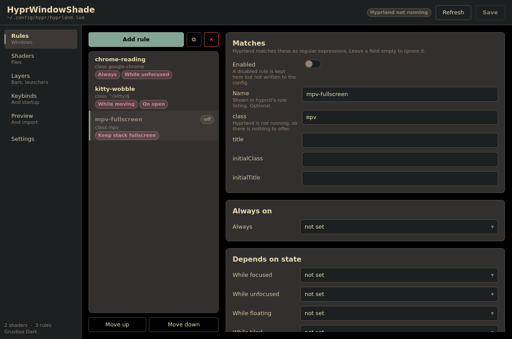
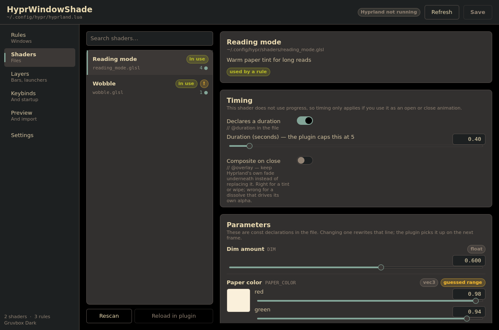
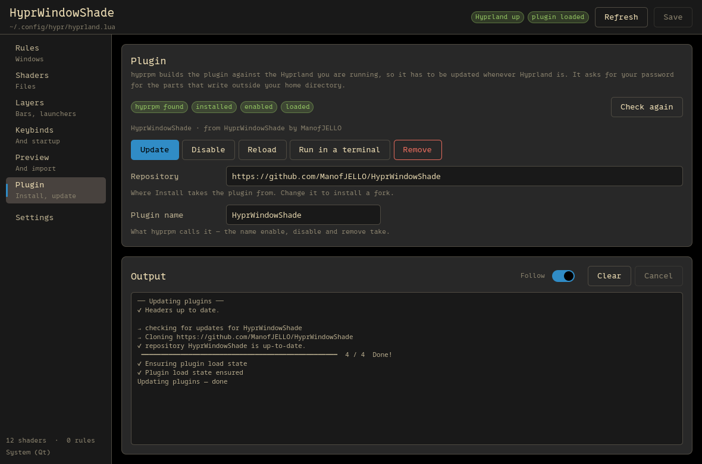

# hyprwindowshade-gui

A Qt Quick front end for [HyprWindowShade](https://github.com/ManofJELLO/HyprWindowShade),
the Hyprland plugin that applies GLSL fragment shaders to individual windows and layers.

It does two things:

* **Writes the plugin's section of `hyprland.lua` for you** — window rules and their shader
  tags, layer shaders, open and close animations, keybinds and startup calls — into a block
  between two marker comments. The rest of your config is never touched.
* **Edits the shaders themselves** — the `const` values inside a `.glsl`, its `// @duration`
  and its `// @overlay`. Edits are staged, not written: move what you like, put any single
  value back, then save that shader when you mean it. The plugin reloads a shader when its
  mtime changes, so saving is the moment it reaches the screen.

It wears your Qt colours by default, so it looks like the rest of your desktop.
Gruvbox dark and light are built in if you would rather it did not; any other
palette is a small TOML file.

---

## Contents

- [What it looks like](#what-it-looks-like)
- [Requirements](#requirements) · [Build and install](#build-and-install)
- [How it writes your config](#how-it-writes-your-config)
- [Shader parameters](#shader-parameters) · [Seeing a shader before you save it](#seeing-a-shader-before-you-save-it)
- [Themes](#themes)
- [Importing rules you already wrote](#importing-rules-you-already-wrote)
- [Installing the plugin](#installing-the-plugin)
- [Settings](#settings)
- [Command line](#command-line)
- [How it is put together](#how-it-is-put-together)
- [Things worth knowing](#things-worth-knowing)

---

## What it looks like



Seven pages down the left:

| Page | What it does |
|---|---|
| **Rules** | Window rules. Match by class or title, then fill any of the plugin's twenty shader tags. |
| **Shaders** | Everything in your shader folder: what each one declares, and sliders for its tunable constants. Each shader is saved — or reverted, value by value — on its own, and previewed on a real window without leaving the page. |
| **Layers** | `layershader`, `layeropenanim`, `layercloseanim` by namespace, with live namespaces offered. |
| **Keybinds** | Toggle binds and session-start calls. |
| **Preview** | Exactly the Lua that will be written, and the importer. |
| **Plugin** | Installs, updates and reloads the plugin itself through `hyprpm`, and shows what it prints. |
| **Settings** | Paths, how the block is written, theme, backups. |

Nothing is written until you press **Save**. Shaders are their own files, so they have their
own save: the header **Save** writes your Hyprland config, and **Save shader** writes the
`.glsl` you are looking at.



*The Shaders page: what a shader declares, its timing, and sliders for the constants inside it.*

---

## Requirements

* **Rust 1.82+** and a C++ compiler — the UI is Qt Quick, reached through
  [CXX-Qt](https://github.com/KDAB/cxx-qt).
* **Qt 6.4 or newer**, with Qt Quick and Qt Quick Controls. On Arch that is
  `qt6-base` and `qt6-declarative`.
* **HyprWindowShade** itself, and a Lua Hyprland config (`~/.config/hypr/hyprland.lua`).
  `hyprland.conf` is not supported here — the plugin's own README explains why `.conf` is on
  its way out.

Hyprland does not have to be running. Without it the app still edits your config and your
shaders; it just cannot offer you the list of open window classes or live layer namespaces,
and the "Try it" buttons and the shader preview are disabled.

The preview additionally wants `grim`, to read frames out of the compositor it starts, and
`swaybg` or `wbg` for its backdrop. Neither is needed for anything else in the app.

## Build and install

```sh
git clone https://github.com/ManofJELLO/hyprwindowshade-gui
cd hyprwindowshade-gui
cargo build --release
```

If `cargo` cannot find Qt, point it at qmake:

```sh
QMAKE=/usr/bin/qmake6 cargo build --release
```

Then either run `./target/release/hyprwindowshade-gui`, or install it with the desktop entry:

```sh
sudo make install          # /usr/local by default
make install PREFIX=~/.local
```

`make install` only copies what is already in `target/release`; it never builds.
Build as yourself first, or root's artifacts end up in `target/` and your next
`cargo build` cannot clean them.

An Arch `PKGBUILD` is in `packaging/`.

---

## How it writes your config

Everything the app generates lives between two marker lines:

```lua
-- >>> HyprWindowShade (managed by hyprwindowshade-gui) >>>
...
-- <<< HyprWindowShade (managed by hyprwindowshade-gui) <<<
```

Anything above or below is preserved byte for byte. Before every write the file is copied to
`~/.config/hyprwindowshade-gui/backups/` with a timestamp, and the write itself is atomic —
a crash mid-save cannot leave you with half a config, which on Hyprland means a session that
will not start.

One line inside the block is a comment carrying the whole configuration as JSON. That is what
the app reads back on the next run, so it never has to parse Lua to know what it wrote. If you
delete the markers, the app forgets everything and leaves your hand-written Lua alone.

**Removing it.** *Preview → Remove managed block* deletes the block and nothing else.

### What the generated Lua looks like

```lua
local hws_shaders = "/home/you/.config/hypr/shaders"

hl.window_rule({
    name  = "chrome-reading-base",
    match = { class = "google-chrome" },
    tag   = "+shader:" .. hws_shaders .. "/reading_mode.glsl",
})

hl.on("hyprland.start", function()
    local hws = hl.plugin.HyprWindowShade
    if not hws then
        hl.notification.create({ text = "[HyprWindowShade] plugin not loaded", … })
        return
    end
    hws.layershader("rofi", hws_shaders .. "/blur.glsl")
end)

hl.bind("SUPER + W", function()
    local hws = hl.plugin.HyprWindowShade
    if not hws then … end
    hws.togglewindowshader(hws_shaders .. "/pixelate.glsl")
end)
```

Three deliberate choices in there:

* **One `hl.window_rule` per tag.** Hyprland's Lua rule takes one `tag`, and the plugin stacks
  tags that match the same window. A rule with four tags becomes four calls sharing a match.
* **The plugin table is looked up inside the closure.** It loads at session start, long after
  the config is parsed, so looking it up at parse time would give you `nil`. The generated
  binds also *say so* with a notification rather than failing silently.
* **Paths go through a local.** One place to change if you move your shader folder. Turn it
  off in Settings if you would rather see full paths.

### Loading the plugin

Settings can add the loader to the same start handler — `hyprpm reload -n`, or
`hyprctl plugin load …`. Both run at session start rather than at parse time, which is what
keeps a corrupt `.so` from taking your desktop with it. The plugin's README has the full
explanation; it is worth reading once.

### If your plugin loads slowly

Startup calls (layer shaders, class shaders) run inside the `hyprland.start` handler, right
after the loader. If the plugin has not finished loading by then they are skipped and you get
a notification. Settings has a **startup delay**: set it above zero and those calls are
re-issued instead through a shell-delayed `hyprctl dispatch`, which runs once the plugin is
certainly up. Leave it at zero unless you actually see the problem.

---

## Shader parameters

The plugin populates a fixed set of uniforms and offers no channel for custom ones, so a
shader's tunable numbers are `const` declarations in its source. Editing one here stages a
new value; **Save shader** rewrites that line in the file — indentation, trailing comments and
line endings intact — and the plugin picks it up on the next frame.

Staging rather than writing is what makes a shader safe to experiment with. Every value that
has moved says **was 0.6** beside it — what the file still holds — and carries a tick on its
slider at that position, so you can see how far you have wandered without reading a number.
A **Revert** beside it puts that one value back. A colour shows the same thing as a colour:
the swatch splits, the shade the file holds sitting underneath the one you are trying. **Revert all** drops everything staged for that
shader; nothing on disk has changed, so there is nothing to undo. Dragging a slider back to
the value the file already has clears the mark by itself.

One save is one write and one backup, however many values it carries — which also means a
long afternoon of tuning no longer pushes the copy you started from out of the backup folder.

The app finds two kinds:

**Annotated**, which is what you want for anything you will come back to:

```glsl
// @param 0.0 1.0 0.01 "Dim amount"
const float DIM = 0.6;

// @param STRENGTH 0 4 "Warmth"          // the named form, for a const further down
const float STRENGTH = 1.5;

// @color "Paper tint"
const vec3 PAPER = vec3(0.98, 0.94, 0.86);

// @bool "Invert"
const bool INVERT = false;
```

`// @param [name] <min> <max> [step] ["Label"]`. Without a name it attaches to the next `const`.

**Inferred**, for shaders you did not write: any `const float/int/bool/vec2/vec3/vec4` with a
plain literal gets a slider with a guessed range, marked *guessed range* in the UI. A `vec3`
whose name contains `color`, `tint` or `rgb` and whose components are all in 0–1 becomes a
colour picker.

A `const` named like a mathematical constant — `PI`, `TAU`, `EPSILON` and the usual
spellings of those — is left out and noted instead. It is not a tuning knob, and a slider
that rewrites it quietly breaks the shader's maths. Annotate it with `// @param` if you
really do want one.

A `const` whose value is an expression — `const float A = 1.0 / 3.0;` — is left alone, on
purpose: the app will not rewrite something it cannot read back.

Two file-level directives are editable too:

* **`// @duration`** — how long a one-shot animation runs. The plugin caps it at 5 seconds and
  falls back to 0.3s when it is absent, warning once per edit if the shader uses `progress`.
  The app shows the same warning before you hit it.
* **`// @overlay`** — composite with Hyprland's own close animation instead of replacing it.
  Right for a tint or a wipe, wrong for a dissolve that drives its own alpha.

Shader files are backed up before every save, same as the config.

---

## Seeing a shader before you save it

*Shaders → Preview → Run it* starts a **second Hyprland**, loads the plugin into
it, and shows you the result in the pane beside the sliders. It is not a
simulation: it is the plugin, doing what it does, to a real window.

That matters more than it sounds. A preview built inside this app would have to
reimplement the plugin — translate the GLSL, compile it another way, and invent
values for the twenty-seven uniforms the plugin fills in every frame. It would be
close, and the places where it was wrong would be invisible. This cannot be
wrong, because it is the same code doing the same job.

The preview renders a **copy** of your shader carrying whatever you have staged,
so the sliders move and the window changes while your own file sits untouched
until you press **Save shader**. The window opens, holds for ten seconds and
closes again on a loop, because an open or close shader only exists during that
transition — a preview of a window already open would show you nothing of it.
Rounding, gaps, borders, opacity, blur and your own animation curves are read
back from your running session, so the window in the pane is shaped like the
windows around it, and it sits on a light-to-dark gradient, which is the only way
to tell whether a dissolve really reaches zero alpha.

Nothing appears on your screen. A nested compositor normally opens a window of
its own; this one is given a headless output and then has that window taken away,
so the only thing that ever sees it is the pane. It shuts down when you stop it,
when you pick another shader, and when you close the app — and if the app dies
without getting the chance, the preview notices that it has been orphaned and
exits by itself a couple of seconds later.

It needs Hyprland running to nest inside, the plugin installed, and `grim` to
read frames out. `swaybg` or `wbg` draws the gradient; without one you get a flat
background and nothing else changes. The button says which of these is missing.

---

## Themes

**System (Qt)** is the default, and is the app taking its colours from Qt's palette —
whatever your platform theme sets, whether that is qt6ct, Kvantum, a desktop's own
theme, or nothing at all. Change your Qt theme and the app follows without a restart.

Qt has no palette role meaning "success" or "warning", and `mid` is a light grey even
under some dark themes, so those few colours are not taken from it: hairlines and shades
are mixed from the window and text colours, which are always present and always in the
right relationship to each other, and ok/warn/error are fixed in a light and a dark
variant. The accent is the desktop's own accent colour where the platform reports one
(Qt 6.6+), and the selection colour otherwise.

**Gruvbox Dark** and **Gruvbox Light** ship with the app and ignore Qt entirely, so they
look the same on any desktop. Anything else is a TOML file in
`~/.config/hyprwindowshade-gui/themes/`; the file stem is the theme's name in the picker.
*Settings → Write an example theme* drops a fully commented one there.

```toml
name = "Example"
base = "gruvbox-dark"     # gruvbox-dark or gruvbox-light; anything you omit comes from here
dark = true
opacity = 0.96            # 0.3 – 1.0; Hyprland composites the rest

[colors]
bg         = "#282828"    # window background
bg_alt     = "#1d2021"    # sidebar and header
surface    = "#32302f"    # cards, rows, inputs
surface_hi = "#3c3836"    # hover
border     = "#504945"
fg         = "#ebdbb2"
fg_dim     = "#d5c4a1"
muted      = "#928374"
accent     = "#83a598"    # focus rings, sliders, active tab
accent_alt = "#d3869b"
ok         = "#b8bb26"
warn       = "#fabd2f"
error      = "#fb4934"
selection  = "#3c3836"
on_accent  = "#1d2021"    # text drawn on the accent colour
```

Every key is optional. `#rgb`, `#rrggbb` and `#aarrggbb` all work. A file with a broken colour
is reported by name and role rather than silently ignored, and the other themes still load.

---

## Importing rules you already wrote

*Preview → Look for rules* reads the parts of your config **outside** the managed block and
shows what it recognises: `hl.window_rule` calls carrying a shader tag, `layershader` and the
layer animations, and plugin calls inside `hl.bind`.

It understands string literals and concatenations with `local`s defined in the same file —
the `local shaders = "/home/you/…"` pattern from the plugin's README. Anything it cannot read
with certainty is listed as skipped rather than guessed at.

Importing adds those entries to the app; **it does not delete your originals**. Look them over,
save, check the result, then remove the hand-written lines yourself. Until you do, both copies
are in the file and the tags will fight — see the plugin's notes on `_default` for what that
looks like.

---

## Installing the plugin

The **Plugin** page drives `hyprpm`, Hyprland's plugin manager: install, update, enable,
disable, reload and remove, with everything it prints in a pane underneath. `hyprpm update`
rebuilds the plugin against the Hyprland you are running, which takes minutes and is what you
want after every Hyprland upgrade.



*After an update: what hyprpm printed, and what it left installed and loaded.*

`hyprpm` escalates by itself — it refuses to run as root, and calls `sudo` for the steps that
write outside your home directory: its plugin store under `/var/cache/hyprpm`, and the
Hyprland headers. There is no terminal behind a window to type that password into, so:

* the operation runs in a session of its own, started with `setsid`;
* `SUDO_ASKPASS` points at this app, re-run as `hyprwindowshade-gui --askpass`;
* sudo, having no terminal to read from, runs that helper instead;
* the helper connects back to the window over a unix socket in
  `$XDG_RUNTIME_DIR/hyprwindowshade-gui/`, which is created mode 0700;
* what you type into the dialog goes straight back down the socket to sudo.

The password is never written to disk, never appears in a command line or in the environment,
and is held in memory only until the operation ends — a single operation escalates more than
once (the state store first, then whatever else it has to write), and being asked twice for
one click would be worse than useless.

A wrong password is noticed and asked for again rather than spent. sudo allows three attempts
and asks its askpass program once per attempt, but hyprpm captures the output of the command
it escalates, so sudo's own "Sorry, try again" usually never reaches the log. What gives it
away is that sudo asks a second time with nothing printed in between: hyprpm is blocked
waiting, so a prompt with no progress since the last answer means that answer was refused.

The pane is output, not a terminal: there is nothing to type into it, which is the whole
reason the password has a dialog of its own.

**Run in a terminal** runs the same operation in a terminal emulator instead — `$TERMINAL`,
or the first of kitty, foot, alacritty, ghostty, wezterm, konsole, gnome-terminal and xterm —
where sudo prompts the way it always has. That is the way out on a system where the askpass
route does not apply, a `doas`-only machine for instance, since `doas` has no askpass.

**Cancel** signals the whole process group, so a half-finished build stops with it.

---

## Settings

| Setting | Notes |
|---|---|
| Hyprland config | Which file the block goes in. Default `~/.config/hypr/hyprland.lua`. |
| Shader folder | Scanned for `.glsl`, `.frag`, `.fs`, one level of subfolders deep. Default `~/.config/hypr/shaders`. |
| Backups to keep | Per file. Default 10. |
| Theme | System (Qt) by default; Gruvbox Dark, Gruvbox Light, or anything in the theme folder. |
| Shader paths | Whether to use the `hws_shaders` local or write full paths. |
| Load the plugin | Nothing, `hyprpm reload -n`, or `hyprctl plugin load <path>`. |
| Startup delay | See above. Zero unless you need it. |
| Reload Hyprland after saving | Runs `hyprctl reload` so new rules apply without logging out. |
| Reload shaders after editing one | Runs after **Save shader**. Off by default — the plugin already reloads on mtime change. |
| Repository | Where **Install** takes the plugin from. Default `https://github.com/ManofJELLO/HyprWindowShade`. |
| Plugin name | What `hyprpm` calls it, which `enable`, `disable` and `remove` take. Default `HyprWindowShade`. |

App settings live in `~/.config/hyprwindowshade-gui/settings.toml`. A malformed file is
reported and ignored, never silently overwritten.

---

## Command line

```sh
hyprwindowshade-gui                 # the app
hyprwindowshade-gui --print-state   # the whole state document as JSON
hyprwindowshade-gui --print-block   # the Lua that would be written
hyprwindowshade-gui --askpass       # sudo's askpass helper, for the Plugin page
```

The two `--print-*` flags do not start Qt, which makes them useful on a machine where the GUI
will not come up, and in a script. `--askpass` is for sudo to call, not for people: see
[Installing the plugin](#installing-the-plugin).

`HWS_SHOT_DIR=<dir>` renders each page to a PNG there and quits — how the screenshots in this
README were made, and how the layout is checked without a compositor.

---

## How it is put together

Two crates:

* **`hws-core`** — everything that decides anything. The config model, the Lua emitter, the
  managed-block reader and writer, the GLSL parser and patcher, the importer, themes, and the
  `hyprctl` calls. No Qt, no UI, and covered by unit tests: `cargo test -p hws-core`.
* **`hws-gui`** — the Qt layer. One `Backend` singleton with a JSON state property, a `run`
  method and a `query` method. The QML reads state and sends commands; it holds no
  configuration logic of its own.

That split is the reason the interesting parts can be tested without a display or a
compositor, and the reason a UI bug cannot corrupt a config.

```
crates/hws-core/src/
    model.rs      the configuration, and the twenty tag slots
    emit.rs       model  -> Lua
    block.rs      the marker block, and the state blob inside it
    import.rs     hand-written Lua -> model, conservatively
    shader/       scan, parse (@param, @duration, @overlay, uniforms), patch
    theme.rs      the built-ins, and the TOML loader
    hyprctl.rs    clients, layers, dispatch
    session.rs    the facade: one state document, one command entry point
crates/hws-gui/
    src/bridge.rs the CXX-Qt bridge, and nothing else
    qml/          Theme and App singletons, components, six pages
```

---

## Things worth knowing

**Motion uniforms are zero on a layer.** A shader that scales its effect by `velocity` or
`peak_velocity` renders a layer surface untouched — no error, no warning, nothing happens. The
Layers page flags this when you pick such a shader, because it is the single most confusing
thing about layer shaders.

**Fullscreen drops everything by default.** A fullscreen window gets no shaders at all unless
you set *While fullscreen* or *Keep stack fullscreen*. That is the plugin's behaviour, not a
limitation here.

**`_default` is documented for eight tags.** The plugin's tag table says any shader tag accepts
the `_default` fallback suffix; its fallback section names eight specifically. The app lets you
set it anywhere but warns on the ones outside that list, so a surprise is a warning rather than
a mystery.

**A duration override does nothing on move and resize.** Hyprland's own `windowsMove` animation
is the clock there. The app hides the duration field for those tags.

**`hyprctl dispatch` lies about failing.** The plugin's functions return nothing, so
`hl.dispatch` rejects the call with a non-zero exit *after* it has already worked. The app
ignores that specific complaint and surfaces anything else.

---

## Licence

MIT. See [LICENSE](LICENSE).
